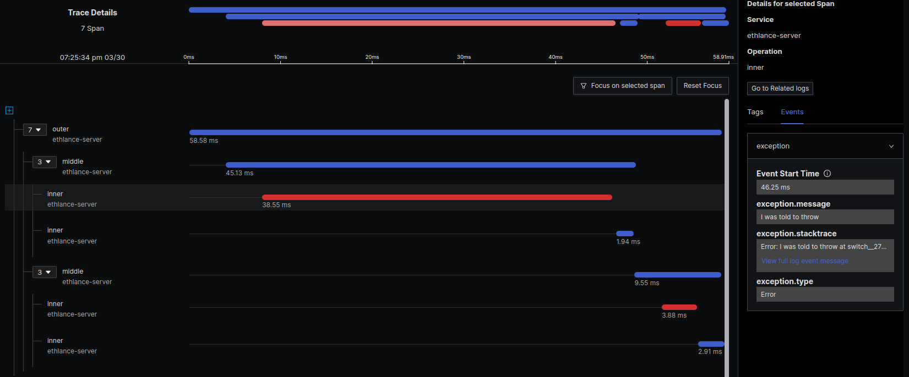

## Open Telemetry demo using ClojureScript

1. Install dependencies: `yarn install`
2. Start compilation: `clojure -A:shadow-cljs watch api`
3. Start server (to get a runtime): `node out/rest_api.js`
3. Open REPL (connects to the right ClojureScript REPL):
```
clojure -Sdeps '{:deps {reply/reply {:mvn/version "0.5.1"}}}' -M -m reply.main --color --attach 3000 --custom-eval '(shadow/repl :api)'
```

Then the demo in `rest-api.tracing-demo` can be used. Following examples are to be input in the REPL

```clojure
(require 'rest-api.tracing-demo)
(in-ns 'rest-api.tracing-demo)
```

## Working example

One example that demonstrates different facilities is the `rest-api.tracing-demo/test-instrumentation`. It:
  - creates active span
  - creates nested spans



## Initial issues

While it's relatively simple to integrate with OpenTelemetry JS library, the
nested spans don't get their parent span from the `context` when using
`clojure.core.async/go` blocks.

Context uses the
[Zone.js](https://github.com/angular/angular/blob/HEAD/packages/zone.js/lib/zone.ts)
from Angular to remember the execution context between asynchronous calls.

## The fix

In Clojurians Slack Thomas Heller (author of shadow-cljs) was so kind to point me to his alternative
implementation of the `go` macro that he had used previously to resolve a similar problem.

- The issue was: https://github.com/clojure/core.async/blob/aa6b951301fbdcf5a13cdaaecb4b1a908dc8a978/src/main/clojure/cljs/core/async.clj#L24
- The slack thread: https://clojurians.slack.com/archives/C03S1L9DN/p1711645242187789
- The original clojure topic: https://clojure.atlassian.net/browse/ASYNC-131

## Examples

### ✅ Example 1: `rest-api.tracing.demo/test-nested-simple` (works as expected)

Output of calling `(rest-api.tracing.demo/test-nested-simple)` in the REPL
> Note: the `parentId` is present and matches `id` of the parent span

```
>>> test-nested-simple
>>> 1. outer
>>> 2. middle
>>> 3. inner
{
  traceId: 'ae5f9ca2122f3755da5fd2cc2626a1dc',
  parentId: '6ac7d72d2b0136cf', // ⚠ <-- parentId present, as it should
  traceState: undefined,
  name: 'inner',
  id: 'e54619499951d2ae',
  kind: 0,
  timestamp: 1711642212762000,
  duration: 6350.44,
  attributes: {},
  status: { code: 0 },
  events: [],
  links: []
}
{
  traceId: 'ae5f9ca2122f3755da5fd2cc2626a1dc',
  parentId: 'e9cee79216f82f7c', // ⚠ <-- parentId present, as it should
  traceState: undefined,
  name: 'middle',
  id: '6ac7d72d2b0136cf',
  kind: 0,
  timestamp: 1711642212755000,
  duration: 15132.657,
  attributes: {},
  status: { code: 0 },
  events: [],
  links: []
}
{
  traceId: 'ae5f9ca2122f3755da5fd2cc2626a1dc',
  parentId: undefined,
  traceState: undefined,
  name: 'outer',
  id: 'e9cee79216f82f7c',
  kind: 0,
  timestamp: 1711642212747000,
  duration: 22713.188,
  attributes: {},
  status: { code: 0 },
  events: [],
  links: []
}
```

### ❌ Example 2: `rest-api.tracing.demo/test-nested-in-separate-function` (_parentId_ missing)

In this case the spans are functions that use `cojure.core.async/go` blocks.
The result is that `parentId` doesn't get assigned and thus the hierachical
(nested) relationship of the spans isn't established

```
>>> test-nested-in-separate-function
>>> 1. outer
>>> 2. middle
>>> 3. inner
{
  traceId: 'ce4d7ff90653a8a54d41690a18f67ca7',
  parentId: undefined,
  traceState: undefined,
  name: 'outer',
  id: 'a80b20409aecdf8a',
  kind: 0,
  timestamp: 1711643414591000,
  duration: 4145.965,
  attributes: {},
  status: { code: 1 },
  events: [],
  links: []
}
{
  traceId: 'c9b286ae539848b97467e1dca5bc8704',
  parentId: undefined, // ⚠ <-- note the parentId missing
  traceState: undefined,
  name: 'middle',
  id: '580c2e1bc6a8cb0c',
  kind: 0,
  timestamp: 1711643414595000,
  duration: 5025.381,
  attributes: {},
  status: { code: 1 },
  events: [],
  links: []
}
{
  traceId: '576493a20e10be951cde6c8bb0df1944',
  parentId: undefined, // ⚠ <-- note the parentId missing
  traceState: undefined,
  name: 'inner',
  id: '959f86881383b247',
  kind: 0,
  timestamp: 1711643414599000,
  duration: 3820.499,
  attributes: {},
  status: { code: 1 },
  events: [],
  links: []
}
```


### ❌ Example 3: `rest-api.tracing.demo/test-nested-go-block` (_parentId_ missing again)
This is pretty similar to example 2. with the difference that the callbacks functions are defined up in the same function.
It shouldn't have any effect but did the example just in case.

> Note: and again the _parentId_ is missing, thus not establishing the nested relationships betweeen the spans

```
>>> test-nested-go-block
>>> outer
>>> middle
>>> inner
{
  traceId: '91d3de6d47320df19be3209aa95782eb',
  parentId: undefined,
  traceState: undefined,
  name: 'outer',
  id: '894ea7332e0a388c',
  kind: 0,
  timestamp: 1711643620765000,
  duration: 327.385,
  attributes: {},
  status: { code: 0 },
  events: [],
  links: []
}
{
  traceId: 'fc1886ad42553172cbf898ebe61694df',
  parentId: undefined, // ⚠ <-- note the parentId missing
  traceState: undefined,
  name: 'inner',
  id: 'ad86f5de07374faf',
  kind: 0,
  timestamp: 1711643620772000,
  duration: 3047.189,
  attributes: {},
  status: { code: 0 },
  events: [],
  links: []
}
{
  traceId: '1682ab315782814e3fd80cfd7d72042a',
  parentId: undefined, // ⚠ <-- note the parentId missing
  traceState: undefined,
  name: 'middle',
  id: '682b52b5e65ccc4e',
  kind: 0,
  timestamp: 1711643620769000,
  duration: 6841.837,
  attributes: {},
  status: { code: 0 },
  events: [],
  links: []
}
```

### References
1. Zone.js
  - implementation: https://github.com/angular/angular/blob/HEAD/packages/zone.js/lib/zone.ts
  - explanation: https://docs.google.com/document/d/1F5Ug0jcrm031vhSMJEOgp1l-Is-Vf0UCNDY-LsQtAIY/edit#heading=h.92cgufnov62k
2. OpenTelemetry contexts
  - docs: https://opentelemetry.io/docs/languages/js/context/
  - spec: https://opentelemetry.io/docs/specs/otel/trace/api/#context-interaction
  - api: https://open-telemetry.github.io/opentelemetry-js/classes/_opentelemetry_api.ContextAPI.html
3. Tracer API (`#startActiveSpan`)
  - https://open-telemetry.github.io/opentelemetry-js/interfaces/_opentelemetry_api.Tracer.html#startActiveSpan
4. Context manager (alternative to start hierarchical context w/ parent-child spans)
  - https://open-telemetry.github.io/opentelemetry-js/interfaces/_opentelemetry_api.ContextManager.html#with
  - implementation of `#with(...)` https://github.com/open-telemetry/opentelemetry-js/blob/3920b158d08daa776280bde68a79e44bafa4e8ea/api/src/api/context.ts#L71
